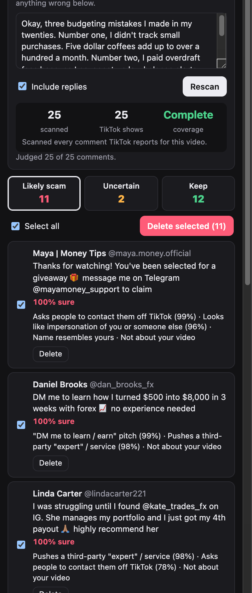
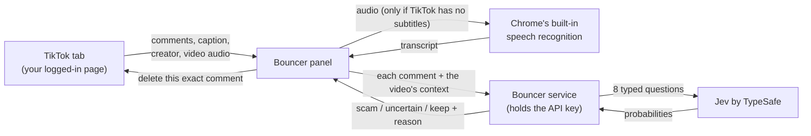

# Bouncer

**Bouncer clears scam bots out of your TikTok comments.** It's a Chrome extension that reads every comment on your video, works out which ones are scams (fake "teachers", "DM me to learn" pitches, impersonators, copy-paste bot rings), and deletes the ones you choose. Real fans stay.



<sub>Screenshot from the test suite: a fictional creator, with comments judged live by Jev.</sub>

## How a creator uses it

1. Install Bouncer in Chrome and open one of your TikToks (logged in as usual).
2. Click the Bouncer icon. A panel opens next to the video, and Bouncer picks up what's said in the video by itself.
3. Click **Scan**. Bouncer scrolls through all the comments and replies (30–60 seconds) and sorts them into **Likely scam / Uncertain / Keep**, each with a short reason.
4. Open **Likely scam**, then click **Select all → Delete → Confirm**. Bouncer deletes them one at a time through TikTok's own Delete button and checks that each one is really gone.

Nothing to set up and no passwords shared: Bouncer works inside your own logged-in browser.

## How it works



- **Context.** For each comment, Jev sees the video's caption, the full transcript, the creator's name, handle and bio, the commenter's name and handle, what the comment replies to, and patterns Bouncer counts itself: the same text pasted many times, several comments pushing the same @account, and look-alike names. Anything missing is marked as missing, never guessed.
- **Transcript.** TikTok's own subtitles when they exist. Otherwise Chrome's built-in speech recognition transcribes the video's audio (about 15–20 s for a 1-minute video, free). Or the creator types it.
- **Safe deleting.** Before every delete, Bouncer re-finds the exact comment by author and text. It stops if the page changed or two comments look identical, and only counts a delete once the comment is gone.

## What is Jev?

[Jev](https://docs.typesafe.ai/introduction) is an AI model from TypeSafe built for making decisions, not writing text. You give it some content and a few precise questions ("does this comment ask people to DM them to learn trading?"), and it answers each with a probability instead of a paragraph. That makes it fast, consistent and very cheap: about **$0.06 per 1,000 comments**.

Bouncer asks Jev 8 questions per comment in a single call:
- an overall verdict: *remove, needs review, or keep*
- seven yes/no checks: *impersonation*, *"DM me to learn/earn"*, *contact off TikTok*, *points to a third-party "teacher"/service*, *self-promotion*, *generic "thought leadership"*, and *is it about the video*

Bouncer's own code then combines those answers with the patterns it counted to pick the group and write the reason. The questions and thresholds live in one file, [`service/judge.mjs`](service/judge.mjs).

## Results on real comment sections

We tested it on six videos from [@orangie](https://www.tiktok.com/@orangie) (a crypto creator whose comments are flooded with bot rings):

- **937 comments** scanned and judged: 381 likely scam, 128 uncertain, 428 keep.
- **84 unique "likely scam" texts, checked by hand; none were genuine.**
- Caught rings such as "@Henry_trader best teacher" (×47), "Ask/learn from @Marrion Jaime" (×85) and "@TonnyNoir to learn" (×34), plus lures like "Slide in for guide" and "wanna be an insider?".
- Kept real viewers: "Teach me pls", "Try Claude", "Keep grinding dog".
- Cost for everything, including all development and testing: **$0.13**.

"Uncertain" holds real judgement calls ("DM me, I can help" on a video asking for help, begging, flexing gains). Look through it before deleting.

---

## For developers

```
extension/           Chrome extension, no build step (Chrome 135+)
  content.js         reads the TikTok page and deletes through TikTok's own controls
  panel.*            the side panel
  config.js          SERVICE_URL: where the service runs
  lib/transcribe.js  video audio → text with Chrome's speech recognition
  lib/patterns.js    counted facts: repeats, @account campaigns, look-alike names, contact details
service/             Node service, zero dependencies: holds the Jev key, spend cap, cache, rate limit
  judge.mjs          what Jev is shown, the questions, the thresholds
api/                 the same service as Vercel serverless functions
test/                unit tests, recorded Jev answers, TikTok-like pages, Chrome end-to-end test
```

### Run it locally

1. Node 20+ and Chrome 135+. Nothing to install.
2. Put `TYPESAFE_API_KEY=...` in a `.env` file in this folder.
3. Run `npm start` and leave it running.
4. Go to `chrome://extensions`, turn on **Developer mode**, click **Load unpacked**, and select `extension/`.

### Put it in creators' hands

1. **Host the service on Vercel.** The repo is ready: `api/` holds the serverless functions, and `vercel.json` and `.vercelignore` are included.
   1. On vercel.com, click **Add New → Project** and import this GitHub repo. Keep the defaults; there is no build step.
   2. Under **Settings → Environment Variables**, add `TYPESAFE_API_KEY` (your key, never in the repo). Once Bouncer is on the Chrome Web Store, also add `ALLOWED_ORIGINS=chrome-extension://<store extension id>` so only Bouncer can use it. Leave it unset for zip pilots, because every unpacked install gets a different ID.
   3. Deploy. Open `https://<project>.vercel.app/api/health` and check that it shows `"ok":true`.

   Vercel keeps nothing between requests, so the spend counter and answer cache reset. Your TypeSafe account balance is the hard spending limit.

   Any Node host works too (`node service/server.mjs` with `HOST=0.0.0.0`).
2. **Point the extension at it:** set `SERVICE_URL` in `extension/config.js` to `https://<project>.vercel.app/api`.
3. **Ship it:**
   - For a pilot, zip `extension/` and have the creator load it unpacked.
   - For everyone, publish on the Chrome Web Store (a one-time $5 developer fee plus review). The privacy note should say that comments, caption and transcript go to the service and TypeSafe, and that audio goes to Chrome's speech recognition.

### Tests

```
npm test             # 25 unit tests + 78 recorded Jev judgements (36 written, 42 real) replayed, no spend
npm run test:chrome  # the real extension in Chrome for Testing: scan, judge, delete safety, speech-to-text
npm run record       # re-ask Jev for the fixtures after changing questions (about $0.003)
```

TikTok changes its page markup without notice. If a scan finds nothing or Delete is never offered, check the selectors at the top of `extension/content.js`.
